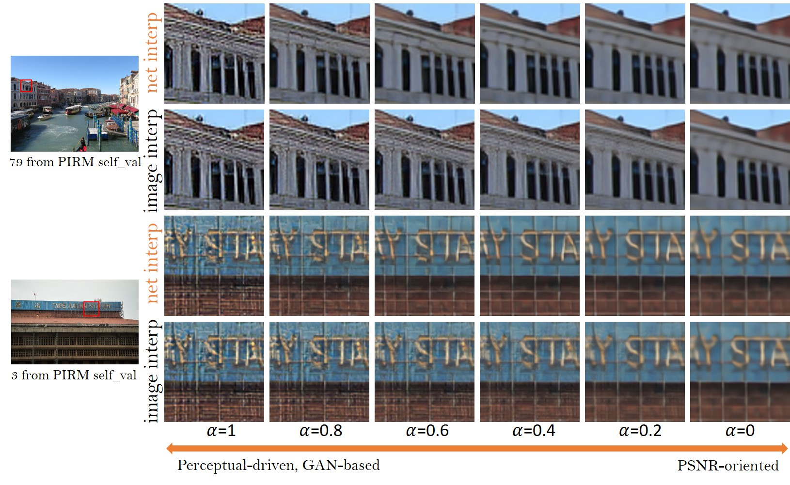

# Upscale-Image Using ESRGAN
This is the Project I have done to upscale the **Blurry and Low Resolution Image**.

- ESRGAN is the enhanced version of the SRGAN. Authors of the ESRGAN tried to enhance the SRGAN by modifying the model architecture and loss functions.

# Steps to use this Model

#### Dependencies

- Python 3
- [PyTorch >= 1.0](https://pytorch.org/) (CUDA version >= 7.5 if installing with CUDA. [More details](https://pytorch.org/get-started/previous-versions/))
- Python packages:  `pip install numpy opencv-python`
- OpenCV glob2: `pip install opencv-python glob2` 

### Test models
1. Clone this github repo.
```
git clone https://github.com/xinntao/ESRGAN
cd ESRGAN
```
2. Place your own **low-resolution images** in `./LR` folder. (There are two sample images - baboon and comic).
3. Download pretrained models from [Google Drive](https://drive.google.com/drive/u/0/folders/17VYV_SoZZesU6mbxz2dMAIccSSlqLecY) . Place the models in `./models`. We provide two models with high perceptual quality and high PSNR performance (see [model list](https://github.com/xinntao/ESRGAN/tree/master/models)).
4. Run test. We provide ESRGAN model and RRDB_PSNR model and you can config in the `test.py`.
```
python test.py
```
5. The results are in `./results` folder.

### Note: I train this Model using CPU(cuz i don't own GPU) so for GPU you need change the **device** value in file `test.py` 


## GAN
Before diving into the ESRGAN first let’s get a high-level understanding of the GAN. GANs are capable of generating Fake data that looks realistic. Some of the GAN applications are to enhance the quality of the image. The high-level architecture of the GAN contains two main networks namely the generator network and the discriminator network. The generator network tries to generate the fake data and the discriminator network tries to distinguish between real and fake data, hence helping the generator to generate more realistic data.


## ESRGAN (Enhanced SRGAN) Enhanced Super-Resolution Generative Adversarial Networks:
The main architecture of the ESRGAN is the same as the SRGAN with some modifications. ESRGAN has Residual in Residual Dense Block(RRDB) which combines multi-level residual network and dense connection without Batch Normalization.


ESRGAN improve the [SRGAN](https://arxiv.org/abs/1609.04802) from three aspects:
1. adopt a deeper model using Residual-in-Residual Dense Block (RRDB) without batch normalization layers.
2. employ [Relativistic average GAN](https://ajolicoeur.wordpress.com/relativisticgan/) instead of the vanilla GAN.
3. improve the perceptual loss by using the features before activation.

In contrast to SRGAN, which claimed that **deeper models are increasingly difficult to train**, our deeper ESRGAN model shows its superior performance with easy training.

<p align="center">
  
</p>
<p align="center">
  
</p>


### Relativistic Discriminator

Besides using standard discriminator ESRGAN uses the relativistic GAN, which tries to predict the probability that the real image is relatively more realistic than a fake image.


### The discriminator loss and adversarial loss is then defined as below.

``` py
dis_loss = K.mean(K.binary_crossentropy(K.zeros_like(fake_logits),fake_logits)+K.binary_crossentropy(K.ones_like(real_logits),real_logits))
gen_loss = K.mean(K.binary_crossentropy(K.zeros_like(real_logit),real_logit)+K.binary_crossentropy(K.ones_like(fake_logit),fake_logit))
```

### Perceptual loss
A more effective perceptual loss is introduced by constraining features before the activation function.

```py

from keras.applications.vgg19 import preprocess_input
generated_feature = vgg(preprocess_vgg(img_hr))
original_fearure = vgg(preprocess_vgg(gen_hr))
percept_loss = tf.losses.mean_squared_error(generated_feature,original_fearure)
```


## Network Interpolation
We propose the **network interpolation strategy** to balance the visual quality and PSNR.

<p align="center">
  
</p>

We show the smooth animation with the interpolation parameters changing from 0 to 1.
Interestingly, it is observed that the network interpolation strategy provides a smooth control of the RRDB_PSNR model and the fine-tuned ESRGAN model.


## Training Details:
ESRGAN scales the Low Resolution(LR) image to a High-Resolution image with an upscaling factor of 4.
For optimization, Adam optimizer is used with default values.

## Conclusion 
we have seen how ESRGAN outperforms its earlier version, SRGAN, and practically we have seen how to implement this environment in your local machine. For More information visit the [original paper](https://arxiv.org/pdf/1809.00219.pdf)


## Credit
@xinntao


