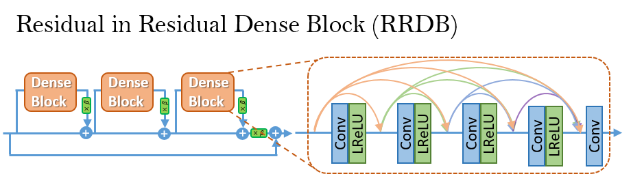

# Upscale-Image Using ESRGAN
This is the project I have done to upscale the blurry Image.

ESRGAN is the enhanced version of the SRGAN. Authors of the ESRGAN tried to enhance the SRGAN by modifying the model architecture and loss functions.

## GAN
Before diving into the ESRGAN first let’s get a high-level understanding of the GAN. GANs are capable of generating Fake data that looks realistic. Some of the GAN applications are to enhance the quality of the image. The high-level architecture of the GAN contains two main networks namely the generator network and the discriminator network. The generator network tries to generate the fake data and the discriminator network tries to distinguish between real and fake data, hence helping the generator to generate more realistic data.
## ESRGAN (Enhanced SRGAN) [:rocket:]

### Enhanced Super-Resolution Generative Adversarial Networks
By Xintao Wang, [Ke Yu](https://yuke93.github.io/), Shixiang Wu, [Jinjin Gu](http://www.jasongt.com/), Yihao Liu, [Chao Dong](https://scholar.google.com.hk/citations?user=OSDCB0UAAAAJ&hl=en), [Yu Qiao](http://mmlab.siat.ac.cn/yuqiao/), [Chen Change Loy](http://personal.ie.cuhk.edu.hk/~ccloy/)


#### BibTeX

    @InProceedings{wang2018esrgan,
        author = {Wang, Xintao and Yu, Ke and Wu, Shixiang and Gu, Jinjin and Liu, Yihao and Dong, Chao and Qiao, Yu and Loy, Chen Change},
        title = {ESRGAN: Enhanced super-resolution generative adversarial networks},
        booktitle = {The European Conference on Computer Vision Workshops (ECCVW)},
        month = {September},
        year = {2018}
    }


#### Dependencies
- Python 3
- [PyTorch >= 1.0](https://pytorch.org/) (CUDA version >= 7.5 if installing with CUDA. [More details](https://pytorch.org/get-started/previous-versions/))
- Python packages:  `pip install numpy opencv-python`
- OpenCV glob2: `pip install opencv-python glob2` 

### Test models
1. Clone this github repo.
```
git clone https://github.com/xinntao/ESRGAN
cd ESRGAN
```
2. Place your own **low-resolution images** in `./LR` folder. (There are two sample images - baboon and comic).
3. Download pretrained models from [Google Drive](https://drive.google.com/drive/u/0/folders/17VYV_SoZZesU6mbxz2dMAIccSSlqLecY) . Place the models in `./models`. We provide two models with high perceptual quality and high PSNR performance (see [model list](https://github.com/xinntao/ESRGAN/tree/master/models)).
4. Run test. We provide ESRGAN model and RRDB_PSNR model and you can config in the `test.py`.
```
python test.py
```
5. The results are in `./results` folder.


## ESRGAN
ESRGAN improve the [SRGAN](https://arxiv.org/abs/1609.04802) from three aspects:
1. adopt a deeper model using Residual-in-Residual Dense Block (RRDB) without batch normalization layers.
2. employ [Relativistic average GAN](https://ajolicoeur.wordpress.com/relativisticgan/) instead of the vanilla GAN.
3. improve the perceptual loss by using the features before activation.

In contrast to SRGAN, which claimed that **deeper models are increasingly difficult to train**, our deeper ESRGAN model shows its superior performance with easy training.

<p align="center">
  
</p>
<p align="center">
  
</p>

## Network Interpolation
We propose the **network interpolation strategy** to balance the visual quality and PSNR.

<p align="center">
  
</p>

We show the smooth animation with the interpolation parameters changing from 0 to 1.
Interestingly, it is observed that the network interpolation strategy provides a smooth control of the RRDB_PSNR model and the fine-tuned ESRGAN model.


## Useful techniques to train a very deep network
We find that residual scaling and smaller initialization can help to train a very deep network. More details are in the Supplementary File attached in our [paper](https://arxiv.org/abs/1809.00219).

<p align="center">
  
  
</p>


